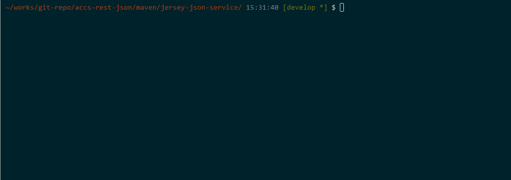

# JSON REST Application Sample on Oracle Application Container Cloud Service

This is a sample applictaion of JSON REST Web service.
It is configured and packaged for Oracle Application Container Cloud Service(ACCS).

## Description

This application logic is just simple.
It implements just CRUD with HTTP Method POST/GET/PUT/DELETE by REST.

It includes configuration for ACCS. And it is packaged for it.
Configuration is the following:

- manifest.json
  - Application Meta Information
    - Runtime
    - Entry command
    - Version
    - etc...
- deployment.json
  - Deployment for ACCS Information
    - Memory size
    - Incutance size
- Environment Variables
  - 12 factor style
    - Application uses environment information from environment variables

## Demo

## Requirement

This sample uses maven plugin the followings when deployed.

- [scs-maven-plugin](https://github.com/shinyay/scs-maven-plugin)
- [accs-maven-plugin](https://github.com/shinyay/accs-maven-plugin)

## Installation

### 1. Create manifest.json

- `$ mvn accs:create-manifest`

### 2. Create deployment.json

- `$ mvn accs:create-deployment`

### 3. Package archive for ACCS

- `$ mvn accs:package`

### 4. Upload an archive to Storage CS

- `$ mvn scs:upload`

### 5. Deploy application for ACCS

- `$ mvn accs:create`

## Licence

Released under the [MIT license](https://gist.githubusercontent.com/shinyay/56e54ee4c0e22db8211e05e70a63247e/raw/44f0f4de510b4f2b918fad3c91e0845104092bff/LICENSE)

## Author

[shinyay](https://github.com/shinyay)
